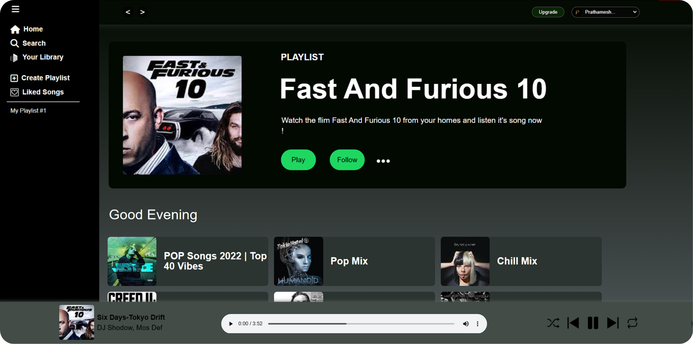

# Spotify Clone - [Live](https://spotifyclone212002.netlify.app/)

Welcome to the Spotify Clone project! This repository contains the code for my music streaming platform web application, designed to resemble the user interface of Spotify.

## About the Project

The Spotify Clone is a web application that mimics the look and feel of Spotify. It allows users to listen to music, create playlists, and explore various artists and genres. The platform aims to provide a similar experience to the original Spotify platform, offering an intuitive music streaming interface.

## Screenshot



## Features

- **🎶 Music Streaming**: Stream music from a variety of genres and artists.
- **📜 Playlist Creation**: Create and manage custom playlists with your favorite tracks.
- **🔍 Search Functionality**: Easily search for songs, albums, and artists.
- **📱 Responsive Design**: Optimized for use on all devices, from desktops to smartphones.

## Technologies Used

- **Frontend**: HTML, CSS, JavaScript, React
- **Hosting**: Netlify

## How to Use

1. Clone this repository:
   ```bash
   git clone https://github.com/Prathmeshpawar21/Web-Dev-Spotify-Clone.git
   ```


## Deployment

This platform is hosted on Netlify. To deploy:
1. Link the repository to your Netlify account.
2. Push changes to the `main` branch, and Netlify will automatically deploy the updates.

---

Thank you for exploring my Spotify Clone! If you find this project helpful, please give it a ⭐ to show your support.
